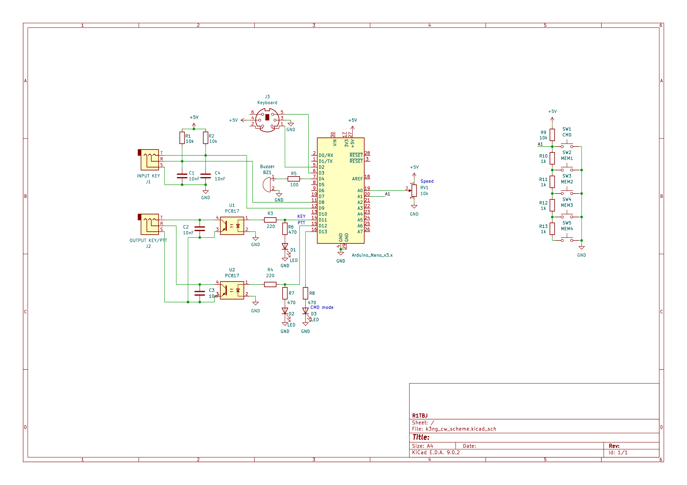

# K3NG CW keyer yet another version...

## Schematic K3NG CW keyer


## Applying my settings
To use my keyer settings, copy the files from the _r1tbj_settings_ directory to the original [k3ng firmware](https://github.com/k3ng/k3ng_cw_keyer) directory and add the following line to the **keyer_hardware.h** file

```C
#define HARDWARE_R1TBJ
```